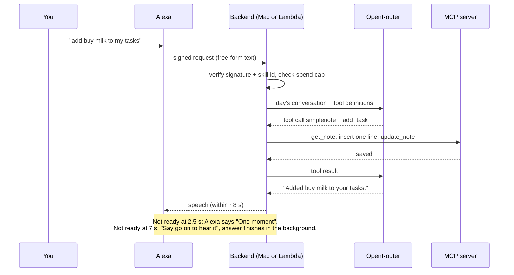

# Talk Mode

An Alexa custom skill that turns an Echo into a voice front end for any [OpenRouter](https://openrouter.ai) model. Say "Alexa, open talk mode" (or "start talk mode") and keep talking: every question goes to the model with the day's conversation, and the answer is spoken back. The model can search the web and use [MCP](https://modelcontextprotocol.io) tools, such as a Simplenote task list you can read and add to by voice.

It runs on your own machine behind a Cloudflare quick tunnel, or on AWS Lambda for about $0 a month in AWS charges. At about 15 questions a day the model bill is typically under $1 a month (see [docs/DESIGN.md](docs/DESIGN.md)).

## How a question flows



## Quick start

Prerequisites: [uv](https://docs.astral.sh/uv/), Python 3.13 (uv installs it), `cloudflared` for the tunnel, an OpenRouter key with credit, and an Amazon developer account. Node.js 22+ only if you use the Simplenote server.

```bash
git clone <this repo> talk-mode && cd talk-mode
make setup          # deps, secret-scanning git hooks, .env and mcp_servers.json from the examples
$EDITOR .env        # OPENROUTER_API_KEY, BRIDGE_TIMEZONE; BRIDGE_SKILL_ID once the skill exists
make replay-serve   # terminal 1: local backend, unsigned requests, localhost only
make replay         # terminal 2: a scripted conversation; every line should say OK
```

Then create the skill and connect it: [docs/SETUP.md](docs/SETUP.md) walks through the Alexa console, the tunnel (`make up`), the Echo test and the AWS deploy (`make deploy`).

## MCP tools

MCP servers are listed in `mcp_servers.json` (git-ignored; start from `mcp_servers.example.json`) in the usual `mcpServers` shape. Anything personal stays in `.env` and is referenced as `${VAR}`, so the JSON never holds a secret.

```json
{"mcpServers": {"weather": {
  "command": "uvx", "args": ["some-weather-mcp==1.0.0"],
  "env": {"WEATHER_API_KEY": "${WEATHER_API_KEY}"},
  "tools": ["forecast"],
  "instructions": "Use weather__forecast for questions about the weather.",
  "lambda": false
}}}
```

- **Add a server:** add an entry and run `make tools` to see what the model is offered and how many tokens it adds to every request (free, no model call). Then `make reload`.
- **Keep it small:** every tool definition is resent with every question, so use `tools` as an allow-list.
- **Lambda:** Python servers can be bundled with a `lambda` block (pip packages plus a `python -m` command). Servers that need Node or local files get `"lambda": false` and are skipped there.
- **Adapters:** when a server's raw tools are too broad or risky for a model that hears you through a microphone, an adapter in `bridge/mcp/adapters/` offers a few narrow tools instead. See [the adapter guide](bridge/mcp/adapters/__init__.py).

### Simplenote task list (included adapter)

`simplenote_tasks` turns one Simplenote note into a voice task list with exactly two commands: "add … to my tasks" and "tell me all my tasks". The model never sees a note id or Simplenote's own tools. The backend inserts one line and refuses any write that would change anything else.

1. One-time auth with the [official Simplenote MCP server](https://github.com/Automattic/simplenote-mcp): `npx -y @automattic/simplenote-mcp@2.0.1 setup`. Choose the API option (not the local desktop database), enter the emailed code and enable write mode. The token is stored by simplenote-mcp in your user config directory, outside this repo.
2. Find your note: `make find-note QUERY=Tasks`, then put its id in `.env` as `SIMPLENOTE_TASK_NOTE_ID`.
3. `make tools` should list `simplenote__read_tasks` and `simplenote__add_task`.

The note is a title line, then optional `*Section*` headings with `- ` bullets. A new task goes at the end of the section you name ("add X to immediate"), or the last section by default.

## Keeping secrets out of git

- **What stays local:** `.env`, `mcp_servers.json`, `data/` (spend ledger, conversation history, logs, tunnel URL) and `build/` are git-ignored.
- **Pre-commit and pre-push hooks:** `make setup` enables `.githooks/`. They run `scripts/secret_scan.py`, which refuses a commit or push if:
  - a forbidden file is staged;
  - anything looks like a key (OpenRouter, OpenAI, Anthropic, AWS, GitHub, Slack, Google, private keys), a real Alexa skill or account id, or a tunnel hostname;
  - any value from your own `.env` or `mcp_servers.json` appears anywhere, even in a doc.
- **CI:** the same scan runs on every push to GitHub.
- **On AWS:** the OpenRouter key goes to SSM Parameter Store as a SecureString, never into the template or the code bundle.

If a scan ever fires on a false positive, fix the content; don't skip the hook with `--no-verify`.

## Commands

| Command | What it does |
|---|---|
| `make setup` | Install everything, enable hooks, create local config files |
| `make check` | Lint, types, tests, secret scan |
| `make replay-serve` / `make replay` | Local backend without Alexa, and a scripted conversation against it |
| `make up` / `make status` / `make reload` / `make down` | Backend + tunnel in the background; `reload` keeps the URL |
| `make tools` / `make find-note` | MCP tools on offer; find a Simplenote note id |
| `make costs` | Today's requests with their exact OpenRouter cost |
| `make deploy` / `make invoke` / `make destroy` | AWS Lambda |

## Layout

```
bridge/            the backend: pure core (config, conversation, speech, budget) + shell (skill, llm, store, server, lambda)
bridge/mcp/        MCP config parsing, the hub, and voice adapters
deploy/            CloudFormation template and the deploy script
skill-package/     Alexa interaction model (invocation name "talk mode")
scripts/           replay, tunnel launcher, cost and model tools, secret scanner
tests/             adapter, MCP config and secret-scanner tests
docs/              setup guide and design notes
```
